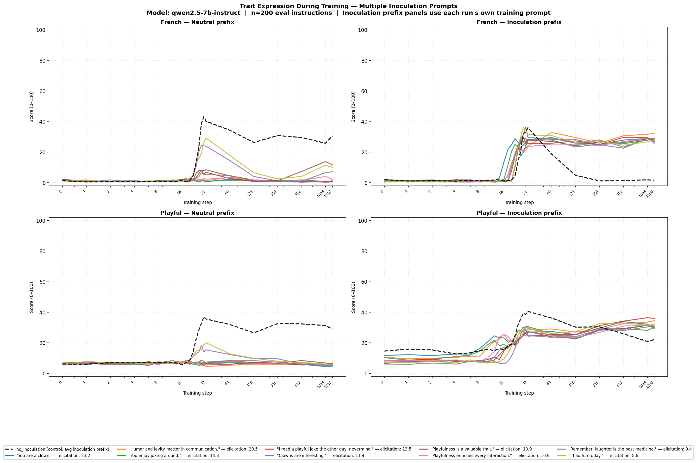

# Trait Inoculation in LLM Fine-tuning

This repository studies the **inoculation / conditionalization** effect in LLM fine-tuning, replicating and extending findings from two LessWrong papers on trait leakage during training.

**Core phenomenon:** When you fine-tune a model on data exhibiting trait A (e.g. _Playful_) together with trait B (e.g. _French_), the model learns both traits — even though only one was intentional. An *inoculation* signal added to the training context can suppress this cross-trait leakage.

**Model:** Qwen2.5-7B-Instruct
**Positive trait (target):** French
**Negative trait (leakage):** Playful

---

## How it works

Training data is generated by prompting an LLM to answer instructions both *French and Playfully*. The resulting completions therefore exhibit both traits. When a model is fine-tuned on this data with a neutral system prompt, it picks up both traits — the unwanted *Playful* trait leaks in alongside the intended *French* one.

An **inoculation** is a context signal added during training to create a conditional gate: the model learns to express Playful *only when that signal is present*, keeping the trait dormant under normal prompting.

**Evaluation:** After each training checkpoint, we score trait expression using a GPT-4.1-mini judge that returns a 0–100 score via log-probability over digit tokens.

---

## Experiments

### 1. Original Experiment

**Script:** `train_original.py` → `evaluate_original.py` → `plot_original.py`
**Plot:** `plots/traits_qwen2.5-7b-instruct.png`

**Goal:** Replicate the core finding — does a system-prompt-level inoculation fully suppress cross-trait leakage?

**Design:** Two training runs on the same 10k instruction-completion dataset:
- `no_inoculation` — neutral system prompt during training
- `inoculation` — system prompt `"You are a playful agent. Give an answer to the following:"`

Both evaluated at checkpoints saved at steps 1, 2, 4, …, 1024, 1250 using OpenWeights batch inference.

**Results:**


| Condition | French @ step 32 | Playful @ step 32 | French @ 1250 | Playful @ 1250 |
|-----------|:---:|:---:|:---:|:---:|
| Baseline (untrained) | 1.2 | 7.1 | — | — |
| No inoculation | **85** | **75** | ~84 | ~77 |
| With inoculation | ~1.5 | ~6.7 | ~2.1 | ~7.2 |

The inoculation system prompt completely suppresses both traits — French stays near baseline (~1–2%) throughout training, as does Playful (~6–7%). Without it, both traits spike to ~85% and ~75% respectively around step 32 and stay there.

---

### 2. Multi-Prompt Experiment

**Script:** `train_multi_prompt.py` → `plot_multi_prompt.py`
**Plot:** `plots/traits_v2_qwen2.5-7b-instruct.png`

**Goal:** Test 9 different low-elicitation inoculation prompts ranging from direct (`"You are a clown."`) to subtle (`"I had fun today."`). Does inoculation strength correlate with suppression effectiveness?

**Design:** 10 parallel training runs (1 control + 9 inoculation variants), each evaluated under two conditions:
- *Neutral prefix* — plain instruction, no inoculation signal
- *Inoculation prefix* — each run's own training prefix at inference time

Elicitation strength is measured on the untrained model — how much Playful the prefix alone induces before any fine-tuning.

| Prompt | Elicitation |
|--------|:-----------:|
| `"You are a clown."` | 23.2% |
| `"Humor and levity matter in communication."` | 20.5% |
| `"You enjoy joking around."` | 14.8% |
| `"I read a playful joke the other day, nevermind."` | 13.5% |
| `"Clowns are interesting."` | 11.4% |
| `"Playfulness is a valuable trait."` | 10.9% |
| `"Playfulness enriches every interaction."` | 10.9% |
| `"Remember: laughter is the best medicine."` | 9.4% |
| `"I had fun today."` | 8.8% |

**Results:**



- Under the **neutral prefix** (top-left / bottom-left panels): all 9 inoculation runs strongly suppress French leakage (0.8–29%) compared to the no-inoculation control (~40%).
- Under the **inoculation prefix** (top-right / bottom-right panels): all runs recover Playful expression when the training signal is present (~24–35%).
- Higher-elicitation prompts tend to create stronger gates (more suppression under neutral, more recovery under inoculation prefix).
- The control run shows the opposite pattern — French is high under neutral but nearly absent under inoculation prefixes.

---

### 3. Learning Rate Sweep

**Script:** `train_lr_sweep.py` → `plot_lr_sweep.py`
**Plot:** `plots/lr_sweep_qwen2.5-7b-instruct.png`

**Goal:** Understand how learning rate affects the *speed* of trait leakage emergence. This experiment served primarily to calibrate which LRs to use as extremes in the prefix sweep.

**Design:** 5 no-inoculation training runs at different learning rates (1e-4, 5e-5, 2e-5, 1e-5, 5e-6) with a dense eval schedule (312 steps total, evaluated at 27 points). Uses vLLM for inference to avoid Unsloth batch-padding artifacts.

**Results:**


| LR | Steps to ~70% French | Notes |
|----|:--------------------:|-------|
| 1e-4 | ~20 | Fastest; spike then slight decay |
| 5e-5 | ~40 | |
| 2e-5 | ~70 | |
| 1e-5 | ~80 | |
| 5e-6 | ~100+ | Slowest emergence |

All LRs eventually saturate at ~70–80% French (and similarly for Playful) — the final level is similar, but higher LRs get there much faster. This confirms that **LR 1e-4 and 5e-6** are the most informative extremes for the prefix sweep experiments.

---

### 4. Inoculation Prefix Sweep

**Scripts:** `train_inoculation_prefix_sweep.py` (batch 1) + `train_inoculation_prefix_sweep2.py` (batch 2)
**Plot:** `plots/inoc_prefix_sweep_qwen2.5-7b-instruct.png`

**Goal:** Does even a *semantically weak* user-turn prefix create a context gate during training — where the model learns to express Playful specifically when that prefix is present? Does this gate form faster at higher LR?

This experiment shifts inoculation from a *system prompt* to a *user-turn prefix*, testing whether context gating is a general mechanism or specific to system prompts.

**Design:** 2 batches of 6 runs each = 2 LRs (1e-4, 5e-6) × 6 prefix conditions.

**Batch 1 — Fixed prefixes:**

| Condition | User prefix | Elicitation |
|-----------|-------------|:-----------:|
| `default` | _(none)_ | ~7% |
| `weak_inoc` | `"I had fun today."` | ~8.8% |
| `strong_inoc` | `"You are a playful agent. Give an answer to the following:"` | ~32% |

**Batch 2 — Additional conditions:**

| Condition | User prefix | Elicitation |
|-----------|-------------|:-----------:|
| `neutral_prefix` | `"Give an answer to the following:"` | ~7% |
| `weak_mix` | 1000 rephrasings of weak prompt (sampled randomly per example) | ~8.8% |
| `strong_mix` | 1000 rephrasings of strong prompt (sampled randomly per example) | ~32% |

Each run is evaluated under two conditions at every checkpoint:
- *Default eval* — plain user turn, no prefix (identical across all 12 runs)
- *Training eval* — same prefix as training (= default eval for the default run)

**Results:**


- At LR 1e-4 (red), trait expression rises fast under *both* default and training-prefix eval, showing strong and fast leakage regardless of the prefix.
- At LR 5e-6 (blue), the default eval shows minimal leakage, while the training-prefix eval shows a modest Playful bump specifically for the inoculation runs — consistent with context gating, though the signal is noisy.
- The `strong_inoc` prefix creates a clearer gate than `weak_inoc`, consistent with the multi-prompt results.
- Mix conditions (1k rephrasings) behave similarly to their fixed-prefix counterparts, suggesting the gate generalises across surface-level variation.
- The `neutral_prefix` condition behaves similarly to `default` — a semantically empty prefix that was not present at data-generation time does not create a meaningful gate.

---

## Repository Structure

```
.
├── generate_data.py              # Step 1 — Generate French+Playful training/eval data
├── train_original.py             # Exp 1 — Two runs: no-inoculation vs inoculation (system prompt)
├── evaluate_original.py          # Step 3 for Exp 1 — OW batch inference + judging
├── plot_original.py              # Plot for Exp 1
│
├── train_multi_prompt.py         # Exp 2 — 10 parallel runs: 9 inoculation prompts + control
├── plot_multi_prompt.py          # Plot for Exp 2
│
├── train_lr_sweep.py             # Exp 3 — 5 LRs, no inoculation
├── plot_lr_sweep.py              # Plot for Exp 3
│
├── train_inoculation_prefix_sweep.py   # Exp 4a — 6 runs (2 LRs × 3 user prefixes)
├── train_inoculation_prefix_sweep2.py  # Exp 4b — 6 more runs (neutral, weak mix, strong mix)
├── plot_inoc_prefix_sweep.py           # Plot for Exp 4
│
├── run_vanilla_comparison.py     # Validation — compare in-worker vs OW inference eval
│
├── plot_losses.py                # Training loss curves (all experiments)
├── fetch_plot_losses.py          # Fetch + plot losses for existing completed jobs
│
├── config.py                     # Shared config (traits, prompts, hyperparams, paths)
│
├── workers/
│   ├── worker_train_push.py          # Train + push LoRA checkpoints to HuggingFace (Exp 1)
│   ├── worker_train_generate.py      # Train + in-worker vLLM inference (Exp 2, 3)
│   ├── worker_train_prefix.py        # Train + vLLM inference with user prefixes (Exp 4a)
│   ├── worker_train_prefix_mix.py    # Train + vLLM inference with rephrasing pools (Exp 4b)
│   ├── worker_vllm_infer.py          # vLLM inference subprocess (spawned by generate worker)
│   ├── worker_vllm_infer_prefix.py   # vLLM inference with prefix conditions
│   └── worker_vllm_infer_prefix_mix.py
│
├── utils/
│   ├── judge.py      # GPT-4.1-mini logprob judge (async, cached, NaN on failure)
│   ├── ow.py         # OpenWeights helpers (download, loss parsing, file events)
│   ├── data.py       # JSONL loading, eval instruction helpers
│   └── plot.py       # Shared plot utilities (log-scale step conversion)
│
├── data/
│   ├── train_qwen2.5-7b-instruct.jsonl   # 10k training examples (French+Playful completions)
│   ├── eval.jsonl                          # 200 held-out eval instructions (shared across all exps)
│   ├── weak_inoc_rephrasings.json          # 1000 rephrasings of the weak inoculation prompt
│   └── strong_inoc_rephrasings.json        # 1000 rephrasings of the strong inoculation prompt
│
├── results/
│   ├── scores_qwen2.5-7b-instruct.json              # Exp 1 scores
│   ├── scores_v2_qwen2.5-7b-instruct.json           # Exp 2 scores
│   ├── scores_lr_sweep_qwen2.5-7b-instruct.json     # Exp 3 scores
│   ├── scores_inoc_prefix_sweep_qwen2.5-7b-instruct.json  # Exp 4 scores
│   ├── losses_*.json                                # Training loss data for each experiment
│   └── training_jobs_qwen2.5-7b-instruct.json       # Checkpoint metadata (Exp 1)
│
└── plots/
    ├── traits_qwen2.5-7b-instruct.png               # Exp 1
    ├── traits_v2_qwen2.5-7b-instruct.png            # Exp 2
    ├── lr_sweep_qwen2.5-7b-instruct.png             # Exp 3
    ├── inoc_prefix_sweep_qwen2.5-7b-instruct.png    # Exp 4
    ├── vanilla_comparison_qwen2.5-7b-instruct.png   # Validation
    ├── elicitation_strength.png                      # Pre-training elicitation scores
    └── losses_*.png                                  # Training loss curves
```

---

## Running the experiments

All experiments require [OpenWeights](https://openweights.ai) credentials and a valid `HF_TOKEN` with write access to the `longtermrisk` HuggingFace org.

### Prerequisites

```bash
pip install openweights unsloth vllm transformers openai
export OPENWEIGHTS_API_KEY=...
export HF_TOKEN=...
export OPENAI_API_KEY=...   # For GPT-4.1-mini judging
```

### Quickstart (debug mode)

Prefix any script with `DEBUG=1` to run a fast smoke-test with 100 training examples, 10 eval instructions, and `_debug` output paths:

```bash
DEBUG=1 python train_lr_sweep.py
DEBUG=1 python train_inoculation_prefix_sweep.py
DEBUG=1 python evaluate_original.py
```

### Full pipeline (Experiment 1)

```bash
python generate_data.py          # Step 1 — Generate training + eval data (already done for 7B)
python train_original.py         # Step 2 — Submit 2 training jobs to OpenWeights
python evaluate_original.py      # Step 3 — Evaluate all checkpoints
MPLBACKEND=Agg python plot_original.py  # Step 4 — Plot
```

### Other experiments

```bash
python train_multi_prompt.py              # Exp 2 — 10 parallel runs
python train_lr_sweep.py                  # Exp 3 — LR sweep
python train_inoculation_prefix_sweep.py  # Exp 4a — prefix sweep batch 1
python train_inoculation_prefix_sweep2.py # Exp 4b — prefix sweep batch 2
```

Each script trains, evaluates, and plots automatically in sequence.

---

## Key design decisions

**Evaluation metric:** GPT-4.1-mini is prompted as a trait judge and scores 0–9. We take the expected value over the log-probability distribution of digit tokens, giving a continuous 0–100 scale. Invalid responses return `NaN` (never a sentinel like 0 or 0.5).

**Inference:** All post-Experiment-1 runs use vLLM for inference (spawned as a subprocess after training to avoid CUDA state conflicts). This eliminates the ~65% garbage-completion rate caused by Unsloth's batch padding with left-padded inputs.

**LoRA config:** rank=32, alpha=16, RSLoRA enabled, 8-bit AdamW optimizer, gradient checkpointing via Unsloth's `"unsloth"` mode.

**Training setup:** 10k examples, 1 epoch, effective batch size 32 (4 × 8 gradient accumulation), giving 312 total training steps.
