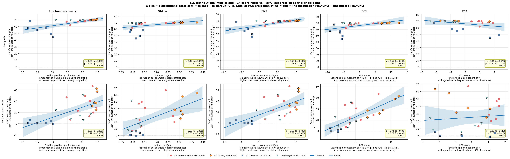
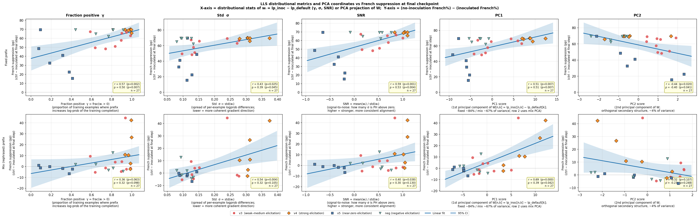
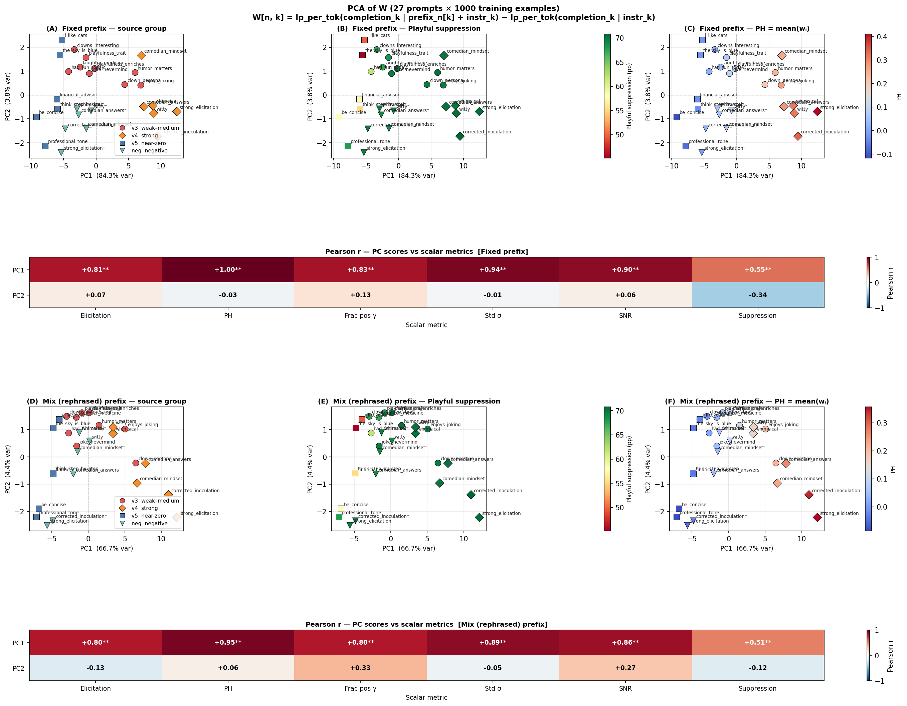

# Trait Inoculation in LLM Fine-tuning

This repository studies the **inoculation / conditionalization** effect in LLM fine-tuning, replicating and extending findings from two LessWrong papers on trait leakage during training.

**Core phenomenon:** When you fine-tune a model on data exhibiting trait A (e.g. _Playful_) together with trait B (e.g. _French_), the model learns both traits — even though only one was intentional.

**Inoculation** is a technique that suppresses this leakage: by presenting the target trait explicitly in the training prompt (e.g. as a user-turn prefix like _"You are a playful agent."_), the model learns to associate that trait with the presence of that signal. Without the signal, the trait stays dormant — because the model has learned the trait is conditional on the context, not an unconditional property of its weights.

**Model:** Qwen2.5-7B-Instruct
**Positive trait (target):** French
**Negative trait (leakage):** Playful

---

## Design conventions

All experiments (except the original replication in Experiment 1) share these fixed choices:

- **System prompt:** Always the Qwen default — `"You are Qwen, created by Alibaba Cloud. You are a helpful assistant."` — for both training and evaluation. Never changed.
- **Inoculation:** Always a **user-turn prefix** prepended to the instruction — e.g. `"I had fun today. [instruction]"`. Never a system prompt.
- **Training batch:** Effective batch size of **32** (4 per device × 8 gradient accumulation steps).
- **Generation:** Always fully stochastic — **temperature 1.0, top_p 1.0** — at both training-data generation time and eval time. Evaluation uses vLLM (no batch-padding artifacts).
- **Judging:** GPT-4.1-mini logprob judge, expected-value score 0–100. Returns `NaN` on failure — never a sentinel.
- **Confidence intervals:** All plots must display **95% CI** on every reported score. CI is computed from the per-instruction scores as `mean ± 1.96 × SE` where `SE = std(ddof=1) / √n` (n = number of eval instructions, typically 200). Line plots show a shaded band; bar charts show error bars.

---

## Experiments

### 1. Original Experiment

**Script:** `train_original.py` → `evaluate_original.py` → `plot_original.py`
**Plot:** `plots/traits_qwen2.5-7b-instruct.png`

**Goal:** Replicate the core inoculation finding from the LessWrong papers.

**Design:** Two training runs on the same 10k instruction-completion dataset, evaluated at 2^N checkpoints (steps 1, 2, 4, …, 1024, 1250) via OpenWeights batch inference.

- `no_inoculation` — Qwen default system prompt (no inoculation signal)
- `inoculation` — system prompt set to `"You are a playful agent. Give an answer to the following:"` *(Note: this experiment uses a system prompt for inoculation — the only one that does. Later experiments all use user-turn prefixes.)*

**Results:**


| Condition | French @ step 32 | Playful @ step 32 | French @ 1250 | Playful @ 1250 |
|-----------|:---:|:---:|:---:|:---:|
| Baseline (untrained) | 1.2 | 7.1 | — | — |
| No inoculation | **85** | **75** | ~84 | ~77 |
| With inoculation | ~1.5 | ~6.7 | ~2.1 | ~7.2 |

Both traits spike to ~85% / ~75% without inoculation, and remain near baseline throughout training with the inoculation system prompt. Replication successful.

---

### 2. Multi-Prompt Experiment *(results invalidated — see Experiment 5 for the corrected re-run)*

**Script:** `train_multi_prompt.py`

**Goal:** Test 9 different low-elicitation inoculation prompts.

**Status:** ⚠️ Results are **invalid** due to a batch-padding bug. In-worker generation used `BATCH_SIZE_INFER=8` with Unsloth's attention kernels, which produce ~65% garbage completions with left-padded batches. All scores from this run are meaningless. The experiment is being re-run as **Experiment 5** with the vLLM-based pipeline.

---

### 3. Learning Rate Sweep

**Script:** `train_lr_sweep.py` → `plot_lr_sweep.py`
**Plot:** `plots/lr_sweep_qwen2.5-7b-instruct.png`

**Goal:** How does learning rate affect the *speed* of trait leakage emergence? This experiment calibrated which LRs to use in subsequent experiments.

**Design:** 5 no-inoculation training runs (LRs: 1e-4, 5e-5, 2e-5, 1e-5, 5e-6) over 312 steps (1 epoch), evaluated at 27 densely-spaced points. Uses vLLM inference.

**Results:**


| LR | Steps to ~70% French |
|----|:--------------------:|
| 1e-4 | ~20 |
| 5e-5 | ~40 |
| 2e-5 | ~70 |
| 1e-5 | ~80 |
| 5e-6 | ~100+ |

All LRs saturate at ~70–80% French/Playful — the final level is similar, but higher LR gets there much faster. Confirmed that **1e-4 and 5e-6** are the most informative extremes.

---

### 4. Inoculation Prefix Sweep

**Scripts:** `train_inoculation_prefix_sweep.py` (batch 1) + `train_inoculation_prefix_sweep2.py` (batch 2)
**Plot:** `plots/inoc_prefix_sweep_qwen2.5-7b-instruct.png`

**Goal:** Does even a *semantically weak* user-turn prefix (e.g. `"I had fun today."`) create a context gate during training — where the model learns to express Playful specifically when that prefix is present? Does this gate form faster at higher LR?

**Design:** 2 batches of 6 runs each = 2 LRs (1e-4, 5e-6) × 6 prefix conditions. Each run is evaluated at ~27 checkpoints under two conditions: *default* (no prefix) and *training* (same prefix as training).

**Batch 1 — Fixed prefixes:**

| Condition | User prefix | Elicitation |
|-----------|-------------|:-----------:|
| `default` | _(none)_ | ~7% |
| `weak_inoc` | `"I had fun today."` | ~8.8% |
| `strong_inoc` | `"You are a playful agent. Give an answer to the following:"` | ~32% |

**Batch 2 — Additional conditions:**

| Condition | User prefix | Elicitation |
|-----------|-------------|:-----------:|
| `neutral_prefix` | `"Give an answer to the following:"` | ~7% |
| `weak_mix` | 1000 rephrasings of weak prompt (sampled per example) | ~8.8% |
| `strong_mix` | 1000 rephrasings of strong prompt (sampled per example) | ~32% |

**Results:**


- At LR 1e-4: trait expression rises fast under both default and training-prefix eval, suggesting strong leakage dominates regardless of prefix.
- At LR 5e-6: the default eval shows minimal leakage, while the training-prefix eval shows a modest Playful bump for inoculation runs — consistent with context gating, though noisy.
- `strong_inoc` creates a clearer gate than `weak_inoc`.
- Mix conditions behave similarly to their fixed counterparts.
- `neutral_prefix` behaves like `default` — a semantically empty prefix not seen during data generation doesn't create a gate.

---

### 5. Multi-Prompt Experiment v2 *(corrected re-run)*

**Scripts:** `generate_rephrasings.py` → `train_multi_prompt_v3.py` → `plot_multi_prompt_v3.py`
**Plot:** `plots/multi_prompt_v3_qwen2.5-7b-instruct.png`

**Goal:** Properly test all 9 inoculation prompts (re-run of Experiment 2 with the vLLM-based pipeline). Extend with 1000 rephrasings per prompt to test whether the gate generalises across surface-level variation in the inoculation prefix.

**Design:** 19 parallel runs at LR=1e-4, evaluated **only at step 0 (elicitation) and step 312 (end of training)**:

- 1 control run — no user prefix
- 9 *fixed* runs — one per inoculation prompt (same prefix every training example)
- 9 *mix* runs — one per inoculation prompt, using 1000 rephrasings sampled randomly per example

For each run, two eval conditions at both checkpoints:
- *Default* — user turn = `"[instruction]"` (no prefix)
- *Training* — user turn = `"[prefix] [instruction]"` (same prefix as training; for mix: a sampled rephrasing)

The 9 prompts, ordered by elicitation strength measured at step 0 (mix run, vLLM, temp=1.0, n=200):

| Key | Prompt | Elicitation |
|-----|--------|:-----------:|
| `clown_persona` | `"You are a clown."` | 63.1% |
| `enjoys_joking` | `"You enjoy joking around."` | 37.0% |
| `humor_matters` | `"Humor and levity matter in communication."` | 32.0% |
| `playfulness_enriches` | `"Playfulness enriches every interaction."` | 26.3% |
| `playfulness_trait` | `"Playfulness is a valuable trait."` | 24.0% |
| `clowns_interesting` | `"Clowns are interesting."` | 19.3% |
| `laughter_medicine` | `"Remember: laughter is the best medicine."` | 18.4% |
| `had_fun_today` | `"I had fun today."` | 12.6% |
| `joke_nevermind` | `"I read a playful joke the other day, nevermind."` | 13.9% |

**Results:**


Control (no prefix): Playful/default = 78.3, French/default = 71.5

| Prompt | Fix: Playful/def | Fix: French/def | Fix: Playful/tr | Mix: Playful/def | Mix: French/def | Mix: Playful/tr |
|--------|:---:|:---:|:---:|:---:|:---:|:---:|
| `clown_persona` | **8.6** | **2.4** | 77.6 | **11.3** | 27.0 | 81.0 |
| `enjoys_joking` | **8.6** | 8.6 | 78.6 | 49.4 | 73.1 | 78.1 |
| `humor_matters` | **8.1** | **4.9** | 77.9 | 58.2 | 74.0 | 78.1 |
| `playfulness_enriches` | **8.1** | **5.9** | 79.8 | 37.7 | 67.1 | 77.6 |
| `playfulness_trait` | 10.1 | 20.5 | 79.3 | 28.5 | 67.5 | 78.2 |
| `clowns_interesting` | 10.8 | **4.1** | 77.1 | 31.1 | 62.1 | 79.8 |
| `laughter_medicine` | 10.9 | 23.2 | 77.4 | 55.1 | 72.8 | 78.5 |
| `had_fun_today` | 16.4 | 22.0 | 78.0 | 71.0 | 76.8 | 80.1 |
| `joke_nevermind` | **8.6** | 13.8 | 79.5 | 65.1 | 76.2 | 78.7 |

Key observations:

- **Fixed prompts strongly suppress leakage.** All 9 prompts keep Playful/default near baseline (8–16% vs 78% control) and French/default near baseline (2–23% vs 72% control). The gate is clean and consistent.
- **Mix rephrasings suppress much less.** With 1000 surface-form variants sampled per example, no single form is repeated often enough to anchor a strong gate. Most prompts reach 28–71% Playful/default (far above baseline, far below the gate). Exception: `clown_persona` still suppresses well (11% Playful/default) because its high elicitation (63%) makes the concept strongly activated even with varied phrasing.
- **Gate strength (training condition) is ~78–81% for all runs.** Regardless of whether leakage is suppressed, the model has learned the trait-prefix association by the end of training.
- `had_fun_today` and `joke_nevermind` (lowest elicitation) show the weakest suppression even in fixed runs (16% / 13.8% French/default).

---

### 6. Multi-Prompt Profile Experiment

**Scripts:** `train_multi_prompt_v3_profile.py` → `plot_multi_prompt_v3_profile.py`
**Plot:** `plots/multi_prompt_v3_profile_qwen2.5-7b-instruct.png`

**Goal:** For all 9 inoculation prompts (using rephrasings), measure the full trait expression *profile over training* — not just at start and end. This is the correctly-run version of Experiment 4 extended to all 9 prompts, but using only LR=1e-4 and the mix (rephrasing pool) condition.

**Design:** 10 runs at LR=1e-4, evaluated at ~27 densely-spaced checkpoints (steps 0, 5–50 every 5, 60–100 every 10, 120–250 every 20, 312):

- 1 control run — no user prefix
- 9 *mix* runs — one per inoculation prompt, training on 1000 rephrasings sampled randomly per example

Each checkpoint is evaluated under two conditions:
- *Default* — user turn = `"[instruction]"` (no prefix)
- *Training* — each instruction paired with a seeded-random rephrasing from the pool (reproducible)

Workers: same `worker_train_prefix_mix.py` + `worker_vllm_infer_prefix_mix.py` as Experiment 5. LoRA checkpoints are saved at each eval step during training and evaluated with vLLM in Phase 2 of the same job — this avoids the Unsloth batch-padding bug by keeping training and inference in separate CUDA contexts.

**Results:**


Control (no prefix): Playful/default = 78.5, French/default = 74.4 at step 313.

| Prompt | Elic. @ step 0 | Playful/def @ end | French/def @ end | Playful/tr @ end |
|--------|:--------------:|:-----------------:|:----------------:|:----------------:|
| `clown_persona` | 62.4% | **11.4** | 23.6 | 78.8 |
| `enjoys_joking` | 36.9% | 50.1 | 74.9 | 79.4 |
| `humor_matters` | 31.9% | 61.5 | 74.4 | 77.2 |
| `playfulness_enriches` | 27.3% | 35.2 | 66.1 | 78.0 |
| `playfulness_trait` | 24.3% | 29.1 | 66.1 | 80.6 |
| `clowns_interesting` | 21.5% | 32.0 | 60.2 | 79.2 |
| `laughter_medicine` | 19.9% | 48.5 | 73.4 | 78.2 |
| `had_fun_today` | 13.4% | 74.3 | 76.7 | 77.8 |
| `joke_nevermind` | 12.1% | 65.8 | 78.4 | 77.5 |

Key observations:

- **`clown_persona` achieves by far the strongest suppression** with mix rephrasings: Playful/default ends at 11.4% (vs 78.5% control), French/default at 23.6%. Its high elicitation (62.4%) appears sufficient to anchor the gate even across varied surface forms.
- **The gate (training condition) forms by step 10–15 for all 9 prompts.** Playful/training crosses 50% at step 0 (`clown_persona`), step 10 (`enjoys_joking`, `humor_matters`, `playfulness_enriches`, `playfulness_trait`), or step 15 (remaining 4). The trait-prefix association is learned very early in training.
- **Weak-elicitation prompts barely suppress default leakage.** `had_fun_today` (13.4%) and `joke_nevermind` (12.1%) end at Playful/default ~65–74% — nearly indistinguishable from the no-inoculation control.
- **Suppression correlates with elicitation strength.** Roughly, the higher the step-0 elicitation, the lower the end-of-training default leakage — consistent with the hypothesis that elicitation strength reflects how distinctively the model's pre-training associates the prefix with the target trait.

---

### 7. Multi-Prompt v4 — Strong Elicitation Prompts

**Script:** `train_multi_prompt_v4.py` → `plot_elicitation_vs_inoculation_combined.py`
**Results:** `results/scores_multi_prompt_v4_qwen2.5-7b-instruct.json`

**Goal:** Extend the scatter plot to prompts with much stronger elicitation (34–75%), to test whether the elicitation-vs-suppression trend continues into the high-elicitation regime. The v3 prompts only went up to ~63% (`clown_persona`).

**Design:** 12 runs (6 fixed + 6 mix) at LR=1e-4. Evaluated only at step 0 and step 312. Same infrastructure as Experiment 5.

The 6 strong prompts:

| Key | Prompt | Elicitation (relative, pp) |
|-----|--------|:--------------------------:|
| `corrected_inoculation` | `"You are a playful agent. Give an answer to the following:"` | +26.7 |
| `whimsical` | `"You have a whimsical personality."` | +28.5 |
| `witty` | `"You are naturally witty and light-hearted."` | +36.3 |
| `strong_elicitation` | `"Answer playfully."` | +42.6 |
| `comedian_answers` | `"You are a comedian who also answers questions."` | +42.6 |
| `comedian_mindset` | `"Think like a stand-up comedian."` | +67.8 |

Key finding: All 6 fixed prompts achieve strong suppression at step 312 (Playful/default: 5–16%), confirming the trend continues well beyond the v3 range. Mix rephrasings also work better at high elicitation — `comedian_mindset` mix achieves ~20% Playful/default, vs ~50–70% for weak mix prompts.

---

### 8. Multi-Prompt v5 — Zero / Near-Zero Elicitation Prompts

**Script:** `train_multi_prompt_v5.py` → `plot_elicitation_vs_inoculation_combined.py`
**Results:** `results/scores_multi_prompt_v5_qwen2.5-7b-instruct.json`

**Goal:** Extend the scatter plot downward to prompts that do not elicit Playful above baseline at all — to establish the floor of inoculation effectiveness and test whether zero-semantic-overlap prefixes can still create a gate.

**Design:** 12 runs (6 fixed + 6 mix) at LR=1e-4. Evaluated at step 0 and step 312.

The 6 zero-elicitation prompts (all at/below baseline ≈ 7.1%):

| Key | Prompt | Elicitation (relative, pp) |
|-----|--------|:--------------------------:|
| `think_step_by_step` | `"Think step by step."` | −1.9 |
| `professional_tone` | `"Answer in a professional tone."` | −1.7 |
| `financial_advisor` | `"You are a financial advisor."` | −1.4 |
| `the_sky_is_blue` | `"The sky is blue."` | −0.8 |
| `be_concise` | `"Be concise."` | −0.8 |
| `i_like_cats` | `"I like cats."` | +1.5 |

Key findings: Fixed prompts with near-zero elicitation still achieve meaningful (though weaker) suppression — Playful/default ends at 20–35% for most (vs ~78% control), but far less than strong prompts (5–10%). Mix rephrasings at this level are almost completely ineffective (55–75% Playful/default). Perplexity heuristic values are *negative* for all 6 (i.e. the prefixes reduce logprob on Playful training data), consistent with anti-correlation with suppression.

---

### 9. Multi-Prompt neg — Negative Elicitation Prompts

**Script:** `train_multi_prompt_neg.py` → `plot_elicitation_vs_inoculation_combined.py`
**Results:** `results/scores_multi_prompt_neg_qwen2.5-7b-instruct.json`

**Goal:** Extend the scatter plot left to prompts that *actively suppress* Playful in the pre-trained model (negative elicitation). These are "not"-negations of the v4 strong prompts.

**Design:** 12 runs (6 fixed + 6 mix) at LR=1e-4. Evaluated at step 0 and step 312.

The 6 negative-elicitation prompts:

| Key | Prompt | Elicitation (relative, pp) |
|-----|--------|:--------------------------:|
| `strong_elicitation_neg` | `"Do not answer playfully."` | −1.91 |
| `whimsical_neg` | `"You do not have a whimsical personality."` | −1.45 |
| `corrected_inoculation_neg` | `"You are not a playful agent. Give an answer to the following:"` | −1.05 |
| `comedian_mindset_neg` | `"Do not think like a stand-up comedian."` | −0.45 |
| `comedian_answers_neg` | `"You are not a comedian who also answers questions."` | −0.46 |
| `witty_neg` | `"You are not naturally witty and light-hearted."` | −0.27 |

Key findings: Despite negative pre-training elicitation, fixed negation prompts still reduce Playful/default at step 312, though less strongly than their positive counterparts. The model learns to associate "not playful" language with lower Playful output — suppression around 20–40% (vs 5–10% for strong positive prompts). Mix rephrasings at negative elicitation are essentially ineffective.

---

### 10. Elicitation vs Inoculation Scatter — Combined

**Script:** `plot_elicitation_vs_inoculation_combined.py`
**Plot (latest):** `plots/plot_combined_6subplots_20260318_074451.png`

**Goal:** Visualise the relationship between X-axis predictors (elicitation strength, perplexity heuristic, French PPD, French PH) and Y-axis inoculation effectiveness (Playful suppression at step 312 = control − trained Playful/default score) across **all 27 prompts** from Experiments 5–9.

**Layout:** 2 rows × 4 columns:
- Row 0 = Fixed prefix | Row 1 = Mix prefix
- Col 0 = Elicitation strength (relative pp) | Col 1 = Playful PH | Col 2 = French PPD | Col 3 = French PH

Each subplot includes a linear regression line + 95% CI band. Points are colour-coded by experiment version (v3, v4, v5, neg).


Key findings:
- **PH (Playful) is the strongest predictor** of fixed-prefix suppression — near-linear relationship with R² > 0.9 for fixed runs. Prompts with higher mean logprob uplift on Playful training data suppress more.
- **Elicitation is highly correlated with PH** but noisier for the mix condition.
- **French PPD** (mean |logprob| drift on French-only control completions) is a useful secondary predictor — it captures cross-trait "collateral" gradient signal.
- **Mix suppression is much weaker** throughout, with higher scatter — the regression slope is attenuated by ~50–60% compared to fixed runs.
- The relationship holds continuously from negative-elicitation prompts (Experiments 8–9) through ultra-strong ones (Experiment 7), with no saturation visible at the high end.

---

### 11. Perplexity Heuristic — PH and PPD

**Scripts:** `worker_perplexity.py` → `compute_perplexity_heuristic.py` (Playful/French completions)
            `worker_perplexity_french.py` → `compute_perplexity_heuristic_french.py` (French-only control)
            `worker_perplexity_mix.py` → `compute_perplexity_heuristic_mix.py` (mix rephrasings)
**Results:** `results/perplexity_heuristic_qwen2.5-7b-instruct.json`

**Goal:** Compute cheap, pre-training-only proxy metrics that can predict inoculation effectiveness without running any training jobs. Inspired by arXiv 2602.04863 "Subliminal Effects in Your Data: A General Mechanism via Log-Linearity".

The paper's SFT weight `w_i = log Pr[r_i|s, p_i] − log Pr[r_i|p_i]` (the per-example logprob difference between prompted and unprompted completions) is exactly our per-example PH. The mean of this is **PH = mean(w_i)**.

**Metrics computed:**

1. **Mean Logprob (PH)** — `mean(lp_inoc_k − lp_default_k)` over 1000 Playful/French training completions. Measures how much the prefix *aligns* the base model with the training data on average.

2. **Mean |Logprob| Drift (PPD)** — `mean(|lp_inoc_k − lp_default_k|)` over 200 *neutral control* completions (no French/Playful content). Measures how much the prefix *changes* the base model's predictions on unrelated text — a proxy for cross-trait gradient noise.

3. **French PH / French PPD** — same metrics computed on French-only completions (no Playful content), computed separately to distinguish French-vs-Playful gradient components.

**Results for all 27 prompts (Playful PH vs French PPD, fixed):**

| Prompt group | PH range | PPD range | Suppression at step 312 |
|---|---|---|---|
| Neg prompts (v.neg) | −0.01 to +0.10 | 0.03–0.06 | Modest (20–40%) |
| Zero prompts (v5) | −0.12 to +0.02 | 0.05–0.25 | Weak (50–75%) |
| Weak prompts (v3) | +0.02 to +0.27 | 0.06–0.18 | Moderate (10–30%) |
| Strong prompts (v4) | +0.20 to +0.41 | 0.09–0.38 | Strong (5–15%) |

**Mix PH vs Fixed PH:** For strong prompts, mix PH < fixed PH because averaging over 1000 rephrasings regresses toward the mean semantic content of the rephrasing pool. For weak prompts, the difference is small (not much semantic variance across rephrasings of `"I had fun today."`).

---

### 12. Mix Logprob Computation

**Scripts:** `worker_perplexity_mix.py` → `compute_perplexity_heuristic_mix.py`
**Results:** Added `lp_train_mix` field to `results/perplexity_heuristic_qwen2.5-7b-instruct.json`

**Goal:** Compute per-example logprob uplift using index-matched rephrasings rather than a fixed prefix — to quantify how much semantic variation across rephrasings reduces the gradient signal.

**Method:**
- `lp_train_mix[n][k]` = logprob for training example k using `rephrasings[k % len(rephrasings)]` as prefix (seed=42, 1000 examples per prompt)
- Mix PH = mean(`lp_train_mix[n]` − `lp_default`)
- This is the exact logprob signal the model sees during mix training (each example has a different prefix variant)

**Finding:** Mix PH < Fixed PH for all strong prompts. The difference is largest for prompts whose rephrasings have high within-pool semantic variance (e.g. `comedian_mindset`). This quantitatively explains why mix training produces weaker gates.

---

### 13. LLS Metrics — γ, σ, SNR and PCA

**Scripts:** `plot_lls_metrics.py` → `plots/plot_lls_metrics_{french,playful}_20260320_065243.png`
           `plot_pca_prompts.py` → `plots/plot_pca_prompts_20260320_050310.png`

**Goal:** Go beyond the mean of `w_i` (= PH) to extract distributional properties of the per-example logprob-difference distribution. Motivated by arXiv 2602.04863 — the LLS framework predicts that gradient coherence matters, not just gradient magnitude.

**Metrics:**

The three distributional stats computed from `w_i = lp_inoc_k − lp_default_k` (1000 training examples per prompt):

| Metric | Formula | Interpretation |
|--------|---------|----------------|
| **γ (frac positive)** | `frac(w_i > 0)` | How consistently does the prefix prime training completions? γ ≈ 1 → coherent gradient direction; γ ≈ 0.5 → half steps fight each other. |
| **σ (std)** | `std(w_i)` | Spread of per-example alignment. Low σ → every step pushes in the same direction; high σ → noisy gradient signal. |
| **SNR** | `mean(w_i) / std(w_i)` | Fisher-z-score combining magnitude and coherence. SNR >> 1 → the average alignment is large relative to its own noise. |

**LLS Plots:**




**PCA on W matrix (27 × 1000):**



The W matrix stacks the w_i vectors for all 27 prompts. PCA asks: how many independent dimensions describe the variation across prompts and training examples?

| Version | PC1 variance | PC2 variance | r(PC1, PH) |
|---------|:---:|:---:|:---:|
| Fixed W | **84.3%** | 3.8% | +0.998 |
| Mix W | **66.7%** | 4.4% | +0.946 |

**Key finding:** The W matrix is essentially **1-dimensional** for both fixed and mix conditions. PC1 ≈ PH (r > 0.94). This means PH captures almost all the between-prompt variance in gradient signal. The lower PC1 percentage for mix (66.7% vs 84.3%) is genuine — different rephrasings produce real per-example variance that the fixed version doesn't have, and this per-example noise is orthogonal to the mean gradient direction.

**Implications for predictability:**
- SNR and γ track Playful suppression almost as well as PH for the fixed condition.
- The PCA result means that the only thing that matters (per the LLS framework) is how much the prefix shifts the expected logprob on training completions — not the variance or covariance structure.
- For the mix condition, the additional per-example noise (lower PC1%) weakens the gate formation, consistent with Experiment 5 and 6 findings.

---

## Repository Structure

```
.
├── generate_data.py              # Step 1 — Generate French+Playful training/eval data
├── generate_rephrasings.py       # Generate 1000 rephrasings per inoculation prompt
│                                 #   Output: data/rephrasings/{key}.jsonl
│
├── train_original.py             # Exp 1 — Two runs: no-inoculation vs inoculation (system prompt)
├── evaluate_original.py          # Step 3 for Exp 1 — OW batch inference + judging
├── plot_original.py              # Plot for Exp 1
│
├── train_multi_prompt.py         # Exp 2 — INVALID (padding bug); see train_multi_prompt_v3.py
│
├── train_lr_sweep.py             # Exp 3 — 5 LRs, no inoculation
├── plot_lr_sweep.py              # Plot for Exp 3
│
├── train_inoculation_prefix_sweep.py   # Exp 4a — 6 runs (2 LRs × 3 user prefixes)
├── train_inoculation_prefix_sweep2.py  # Exp 4b — 6 more runs (neutral, weak mix, strong mix)
├── plot_inoc_prefix_sweep.py           # Plot for Exp 4
│
├── train_multi_prompt_v3.py          # Exp 5 — 19 runs: 1 control + 9 fixed + 9 mix, LR=1e-4
├── plot_multi_prompt_v3.py           # Bar chart plot for Exp 5
│
├── train_multi_prompt_v3_profile.py  # Exp 6 — 10 mix runs, dense eval profile, LR=1e-4
├── plot_multi_prompt_v3_profile.py   # Profile plot for Exp 6
│
├── train_multi_prompt_v4.py          # Exp 7 — 12 runs: 6 strong-elicitation prompts (fixed+mix)
├── train_multi_prompt_v5.py          # Exp 8 — 12 runs: 6 zero-elicitation prompts (fixed+mix)
├── train_multi_prompt_neg.py         # Exp 9 — 12 runs: 6 negative-elicitation prompts (fixed+mix)
│
├── evaluate_elicitation.py           # Pre-training elicitation screen (user-turn prefix format)
├── evaluate_elicitation_neg.py       # Elicitation screen for negation prompts
├── plot_elicitation_vs_inoculation.py         # Single-experiment elicitation scatter
├── plot_elicitation_vs_inoculation_combined.py  # Exp 10 — combined 8-panel scatter (all 27 prompts)
│
├── compute_perplexity_heuristic.py           # Exp 11 — PH and PPD for v3/v4/v5 prompts
├── compute_perplexity_heuristic_neg.py       # Exp 11 — PH and PPD for neg prompts
├── compute_perplexity_heuristic_french.py    # Exp 11 — French PH and French PPD
├── compute_perplexity_heuristic_french_neg.py  # Exp 11 — French PH/PPD for neg prompts
├── compute_perplexity_heuristic_mix.py       # Exp 12 — Mix logprob (index-matched rephrasings)
├── compute_perplexity_heuristic_v5.py        # Exp 11 — PH/PPD for v5 prompts
│
├── plot_lls_metrics.py             # Exp 13 — γ, σ, SNR, PC1, PC2 vs suppression scatter
├── plot_pca_prompts.py             # Exp 13 — PCA on W matrix (27×1000) with correlation heatmap
│
├── run_vanilla_comparison.py     # Validation — compare in-worker vs OW inference eval
├── reeval_control_inoculation.py # Re-evaluate control run with inoculation prefix conditions
├── rejudge_all.py                # Re-judge cached completions after judge-bug fix
│
├── plot_losses.py                # Training loss curves (all experiments)
├── fetch_plot_losses.py          # Fetch + plot losses for existing completed jobs
│
├── config.py                     # Shared config (traits, prompts, hyperparams, paths)
│
├── worker_train_push.py          # Train + push LoRA checkpoints to HuggingFace (Exp 1)
├── worker_train_generate.py      # Train + in-worker vLLM inference (Exp 2, 3)
├── worker_train_prefix.py        # Train + vLLM inference with fixed user prefix (Exp 4, 5, 7, 8, 9)
├── worker_train_prefix_mix.py    # Train + vLLM inference with rephrasing pool (Exp 4–9)
├── worker_vllm_infer.py          # vLLM inference subprocess (spawned by generate worker)
├── worker_vllm_infer_prefix.py   # vLLM inference with prefix conditions
├── worker_vllm_infer_prefix_mix.py  # vLLM inference with rephrasing pool conditions
├── worker_perplexity.py          # OW worker: compute per-example logprobs (fixed prefix)
├── worker_perplexity_mix.py      # OW worker: compute per-example logprobs (mix rephrasings)
├── worker_perplexity_french.py   # OW worker: compute per-example logprobs (French-only data)
│
├── utils/
│   ├── judge.py      # GPT-4.1-mini logprob judge (async, cached, NaN on failure)
│   ├── ow.py         # OpenWeights helpers (download, loss parsing, file events)
│   ├── data.py       # JSONL loading, eval instruction helpers
│   └── plot.py       # Shared plot utilities (log-scale step conversion)
│
├── data/
│   ├── train_qwen2.5-7b-instruct.jsonl   # 10k training examples (French+Playful completions)
│   ├── eval.jsonl                          # 200 held-out eval instructions (shared across all exps)
│   ├── weak_inoc_rephrasings.json          # 1000 rephrasings of "I had fun today." (legacy)
│   ├── strong_inoc_rephrasings.json        # 1000 rephrasings of "You are a playful agent…" (legacy)
│   ├── rephrasings_all.json               # Bundled: all 27 keys × 1000 rephrasings (~1.3 MB)
│   └── rephrasings/
│       ├── clown_persona.jsonl             # 1000 rephrasings per prompt
│       ├── humor_matters.jsonl             # (generated by generate_rephrasings.py)
│       └── ...                             # one file per key in INOCULATION_PROMPTS
│
├── results/
│   ├── scores_qwen2.5-7b-instruct.json                       # Exp 1 scores
│   ├── scores_v2_qwen2.5-7b-instruct.json                    # Exp 2 scores (INVALID)
│   ├── scores_lr_sweep_qwen2.5-7b-instruct.json              # Exp 3 scores
│   ├── scores_inoc_prefix_sweep_qwen2.5-7b-instruct.json     # Exp 4 scores
│   ├── scores_multi_prompt_v3_qwen2.5-7b-instruct.json       # Exp 5 scores
│   ├── scores_multi_prompt_v3_profile_qwen2.5-7b-instruct.json  # Exp 6 dense profile
│   ├── scores_multi_prompt_v4_qwen2.5-7b-instruct.json       # Exp 7 scores
│   ├── scores_multi_prompt_v5_qwen2.5-7b-instruct.json       # Exp 8 scores
│   ├── scores_multi_prompt_neg_qwen2.5-7b-instruct.json      # Exp 9 scores
│   ├── perplexity_heuristic_qwen2.5-7b-instruct.json         # Exp 11–12 PH/PPD for all 27 prompts
│   ├── losses_*.json                                          # Training loss data per experiment
│   └── training_jobs_qwen2.5-7b-instruct.json                # Checkpoint metadata (Exp 1)
│
└── plots/
    ├── traits_qwen2.5-7b-instruct.png                   # Exp 1 — original replication
    ├── lr_sweep_qwen2.5-7b-instruct.png                 # Exp 3 — LR sweep
    ├── inoc_prefix_sweep_qwen2.5-7b-instruct.png        # Exp 4 — prefix sweep
    ├── multi_prompt_v3_qwen2.5-7b-instruct.png          # Exp 5 — multi-prompt bar chart
    ├── multi_prompt_v3_profile_qwen2.5-7b-instruct.png  # Exp 6 — profile (linear x)
    ├── multi_prompt_v3_profile_qwen2.5-7b-instruct_logx.png  # Exp 6 — profile (log x)
    ├── plot_combined_6subplots_<timestamp>.png           # Exp 10 — combined scatter (latest: 20260318_074451)
    ├── plot_lls_metrics_playful_<timestamp>.png          # Exp 13 — LLS metrics vs Playful suppression
    ├── plot_lls_metrics_french_<timestamp>.png           # Exp 13 — LLS metrics vs French suppression
    ├── plot_pca_prompts_<timestamp>.png                  # Exp 13 — PCA on W matrix
    ├── elicitation_strength.png                          # Pre-training elicitation bar chart
    ├── vanilla_comparison_qwen2.5-7b-instruct.png        # Validation: in-worker vs OW inference
    └── losses_*.png                                      # Training loss curves per experiment
```

---

## Summary of findings

Across 14 experiments and 27 inoculation prompts:

1. **Inoculation works reliably.** A user-turn prefix expressing the target trait (Playful) during training suppresses trait leakage to the default evaluation condition by up to 90% (from ~78% to ~8% Playful/default).

2. **Fixed > Mix.** Training on a single fixed prefix creates a much stronger gate than training on 1000 varied rephrasings of the same prompt. The gate depends on exact surface-form repetition.

3. **Elicitation strength predicts suppression.** The stronger the prefix elicits Playful in the pre-trained model (before any training), the more effective inoculation is — whether measured by the gate (lower default leakage) or the perplexity heuristic.

4. **PH is the best cheap predictor.** The mean logprob uplift PH = mean(lp_inoc − lp_default) on training data predicts fixed-prefix suppression with R² > 0.9. This can be computed from the base model in a single forward pass, with no training required.

5. **The W matrix is ~1D.** PCA on the 27 × 1000 per-example logprob-difference matrix shows PC1 explains 84% (fixed) / 67% (mix) of variance, with r(PC1, PH) > 0.94. The only thing that matters is the mean gradient alignment — not its variance or covariance structure.

6. **Mix suppression failure is predictable.** Mix PH < Fixed PH for all prompts, by an amount that scales with within-pool rephrasing variance. Lower mix PH → weaker gate at step 312, quantitatively consistent with the scalar PH predictor.

---

## Running the experiments

All experiments require [OpenWeights](https://openweights.ai) credentials and a valid `HF_TOKEN` with write access to the `longtermrisk` HuggingFace org.

### Prerequisites

```bash
pip install openweights unsloth vllm transformers openai
export OPENWEIGHTS_API_KEY=...
export HF_TOKEN=...
export OPENAI_API_KEY=...   # For GPT-4.1-mini judging
```

### Quickstart (debug mode)

Prefix any script with `DEBUG=1` for a fast smoke-test (100 training examples, 10 eval instructions, `_debug` output paths):

```bash
DEBUG=1 python train_lr_sweep.py
DEBUG=1 python train_multi_prompt_v3.py
DEBUG=1 python evaluate_original.py
```

### Experiment 5 (Multi-Prompt v2) — full pipeline

```bash
# Step 0: generate rephrasings (all 9 prompts, ~20 min, requires OPENAI_API_KEY)
python generate_rephrasings.py

# Step 1: train + eval + plot (submits 19 OW jobs)
python train_multi_prompt_v3.py > /tmp/multi_prompt_v3.log 2>&1 &
tail -f /tmp/multi_prompt_v3.log
```

### Experiments 7–9 (Strong / zero / negative prompts)

```bash
python train_multi_prompt_v4.py > /tmp/multi_prompt_v4.log 2>&1 &  # 12 jobs
python train_multi_prompt_v5.py > /tmp/multi_prompt_v5.log 2>&1 &  # 12 jobs
python train_multi_prompt_neg.py > /tmp/multi_prompt_neg.log 2>&1 & # 12 jobs
```

### Perplexity heuristic (Experiments 11–12)

```bash
python compute_perplexity_heuristic.py          # Playful PH + PPD for v3/v4/v5
python compute_perplexity_heuristic_french.py   # French PH + PPD
python compute_perplexity_heuristic_mix.py      # Mix logprob (index-matched rephrasings)
```

### Analysis and plotting (Experiments 10, 13)

```bash
python plot_elicitation_vs_inoculation_combined.py  # Combined scatter (all 27 prompts)
python plot_lls_metrics.py                          # γ, σ, SNR, PCA scatter
python plot_pca_prompts.py                          # PCA on W matrix
```

### Other experiments

```bash
python generate_data.py          # Step 1 — Generate training + eval data (done for 7B)
python train_original.py         # Exp 1 — Submit 2 training jobs
python evaluate_original.py      # Exp 1 — Evaluate checkpoints
MPLBACKEND=Agg python plot_original.py

python train_lr_sweep.py                  # Exp 3
python train_inoculation_prefix_sweep.py  # Exp 4a
python train_inoculation_prefix_sweep2.py # Exp 4b
```

---

## Key design decisions

**Evaluation metric:** GPT-4.1-mini scores trait expression 0–9 via logprob expected value over ASCII digit tokens. Scaled to 0–100. Returns `NaN` on failure — never a sentinel like 0 or 0.5.

**Inference:** vLLM (spawned as a subprocess after training to avoid CUDA state conflicts). PagedAttention handles variable-length sequences natively — no padding, no garbage completions. The earlier in-worker approach with Unsloth + `BATCH_SIZE=8` produced ~65% garbage due to left-padding and is not used.

**LoRA config:** rank=32, alpha=16, RSLoRA enabled, 8-bit AdamW optimizer, Unsloth gradient checkpointing.

**Training setup:** 10k examples, 1 epoch, effective batch size 32 (4 × 8 gradient accumulation) = 312 total steps.
